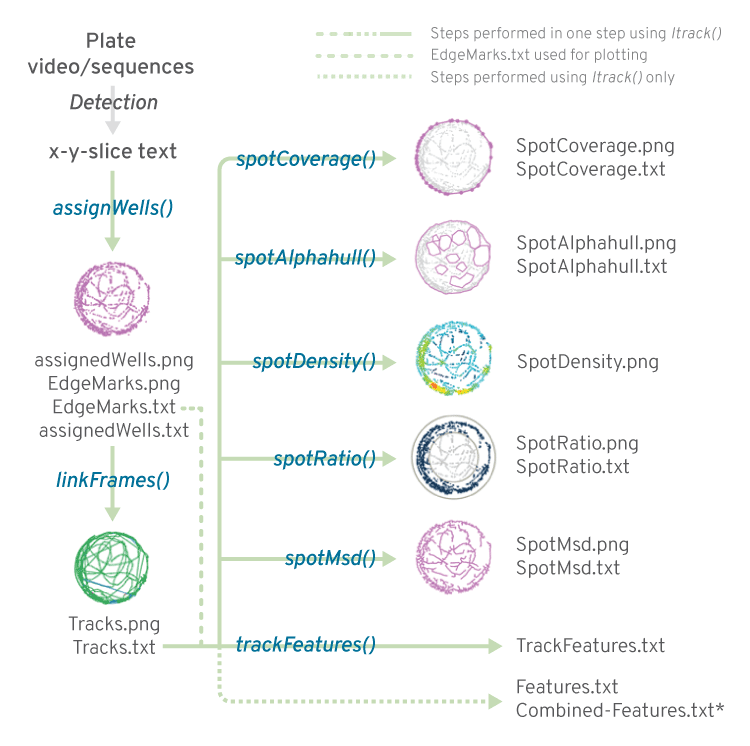
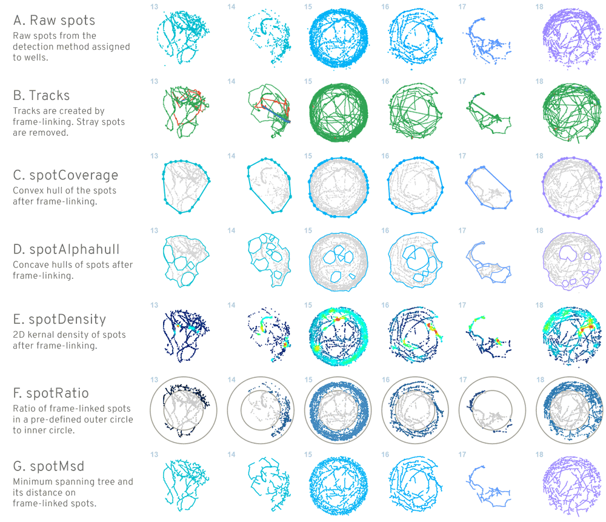

# drtracker 1.1.0 

`drtracker` is an R package to track movement of single Zebrafish larvae per well in 24 or 48 well assay plates from xy data and then compute spot and track features. The features computed are well assignment of spots, spot coverage, convex and concave hulls of spots, spot density, spot distribution in the well, frame by frame linking of spots to produce tracks, track length, track mean speed and track max speed.  

Note that the code is designed for 24 or 48 well plates only. Handles single larva per well. The code has been tested on tif files with 15000 frames which equates to videos recorded for 10 mins at 25 fps.

## 1. Installation  

Download and install [R software](https://cran.rstudio.com/) appropriate for your system.  

```r
#load devtools package
library(devtools)
install_github('royfrancis/drtracker')

#load library for use
library(drtracker)
```

## 2. Workflow  
The workfow can be divided into *Detection*, *Linking* and *Feature computation*. Detection involves identifying the spots on each frame. Detection can be done using any algorithm and using any software. If you perfrom your own detection to generate xy data, you can skip the following section 2.1.  

For this demonstration, I will use ImageJ for *Detection* to generate xy coordinate data. *Linking* is the process of connecting the xy coordinates frame to frame to create tracks. And the final step is generating track statistics from tracks. *Linking* and *Feature computations* will be done in R. I am running Windows 8.1 64 bit, R 3.2.0 64 bit and Fiji ImageJ 1.50b. I am using 24 well plates.  

  
__Fig 1.__ *An overview of the workflow. Larvae are detected in images to produce an x-y-slice text output. This text file is used in `drtracker` to link frames and compute features. Text in blue italics indicate various functions used in various steps. Regular grey text ending in .txt or .png indicates outputs from various functions. An additional function `ltrack()` is available as a wrapper around other functions to perform all the functions in one step. The green line indicates all steps carried out by `ltrack()`. The Features.txt contains all features from all functions in one text file. This is exported only when using `ltrack()`. If running `ltrack()` for multiple files, a combined feature file Combined-Features.txt is exported. The EdgeMarks.txt file is used in all functions to plot figures.*  

### 2.1 Detection

Use a 24 or 48 well plate. Use single larva per well in clean water with minimal colour. Lighting must not induce strong reflection on plates. Use matte white plates if possible. Videos with 500 frames or more work better to remove background. Note the framerate of the video in fps (frames per second). Calibrate the size in the video to determine 1 pixel = ? mm.

Detection is carried out in ImageJ.  

1. The video must be imported into Fiji ImageJ. If the video is not in .avi format, convert to uncompressed .avi using a tool such as VirtualDub.   
2. Save the video as a .tif sequence and/or continue to next step.  

  
__Fig 2.__ *View of a typical 24 well plate with few day old single zebrafish larvae in each well.*  

3. Mark the edges of plate (4 spots) and larvae positions on frame 1. Set the brush size to something like size 8-10 black colour. If the well/wells are empty, do not mark anything. When marking the 4 edge spots, imagine connecting the 4 spots to create a rectangle. No larval position must touch that rectangle. If they do, then mark the edges further out.     

  
__Fig 3.__ *View of a plate with marking in the first frame. The edges of the wells and the positions of larvae are marked in frame 1.*  

4. Remove background. Go to `Image` > `Stacks` > `Z Project`. Set `Projection type` to `Average Intensity` or `Median Intensity`. Click `OK`. Go to `Process` > `Image Calculator`. Choose the tif stack/sequence as `Image1`, the averaged single image as `Image2` and set `Operation` to `Difference`. Check `Create new window` and `32-bit (float) result`. Click `OK`. In the `Process Stack?` window, click `Yes`.  

  
__Fig 4.__ *Blank plate after Average Z stack. Works best when larvae moves around a lot and number of frames are at least few hundred.*  
  
  
__Fig 5.__ *Larval positions without the plate after Image Difference.*  

5. Convert to binary. Go to `Image` > `Adjust` > `Threshold`. Change `Default` to `Max Entropy`. Check `Dark background` and uncheck `Stack histogram`. Click `Apply`. When `NaN Background` windows opens, uncheck `Set background pixels to NaN`. Click `OK`. In the `Convert Stack to binary` window, check `Calculate threshold for each image`, uncheck `Only convert current image`, leave rest as default, then, click `OK`.  

  
__Fig 6.__ *Image after thresholding.* 

6. Remove stray spots. Go to `Process` > `Binary` > `Options`. Set `Iterations` to `2`, `Count` to `5`, check `Black background`, uncheck `Pad edges..`, set `EDM output` to `Overwrite` and `Do` to `Erode`. Click `OK`. In the `Process Stack?` window, click `Yes`. This will remove small stray spots.  

Then go to same `Options` and set `Iterations` to `10`, `Count` to `3` and `Do` to `Dilate`. Click `OK`. In the `Process Stack?` window, click `Yes`. This will remove more small stray spots and enlarge the spots.  

The first frame must have exactly 24 larvae spots and the four edge spots. Any extra spots must be removed with the brush tool by painting black.  

  
__Fig 7.__ *Image after Erosion/Dilation.* 

7. Analyse spots. Go to `Analyze` > `Set measurements`. Check `Area`, `Centroid` and `Stack position`. Click `OK`.

Go to `Analyze` > `Analyze particles`. `Size` should be `0-Infinity`, `Circularity` as `0.00-1.00` and `Show` `Nothing`. Check `Display results` and uncheck `Exclude on edges`. Click `OK`. In the `Process Stack?` window, click `Yes`.  

8. Save the binary video file if required. Save the `Results` table with suitable filename as .txt. The filename will be used to refer to this file in further analyses.  

### 2.2 Linking and Feature calculation using `drtracker`  

The input file can be prepared in any way or generated from any application. The input file must be a tab-delimited dot (.) as decimal text file. The file must have a minimum of three columns named `x`, `y` and `slice` ('x-y-slice file'). We use the text file exported from ImageJ. Start R and load `drtracker` library. 

The workflow can be performed in two ways.  

#### 2.2.1 Using single function `ltrack()`  

Here we use the function `ltrack()` to perform all the steps in one function.  

```r
#Load the library
library(drtracker)

#Help and all arguments
?ltrack

#set a working directory
#setwd("C:/bla/bla")

#Select one or more files
files=choose.files() #works for windows
files="somename.txt"
files=c("file1.txt","file2.txt")

#For now we read in a file path with this package
fpath <- system.file("files/testfile.txt",package="drtracker")

#Usage
#Use mm and fps values for your video. Text data and plots are exported by default.
ltrack(files=fpath, wells=24, mm=5.4, fps=25)
#check working directory, 15 files are exported.

#To not export text and plots, use
ltrack(files=fpath, wells=24, mm=5.4, fps=25, exportplot=FALSE, exportdata=FALSE)

#turn off calculation of some features eg. spotcoverage, spotalphahulls
ltrack(files=fpath, spotcoverage=FALSE, spotalphahulls=FALSE)
```  

The `ltrack()` function is a wrapper for several sub-functions. The input for `ltrack()` is always the x-y-slice file. `ltrack()` assigns spots to wells creating an 'xx-AssignedWells.txt' file and 'xx-EdgeMarks.txt' file, then links spots frame by frame and creates a tracks file ('xx-Tracks.txt'). This tracks file is used by other sub-functions to compute features. The `ltrack` function by default runs all steps from start to end. If the 'xx-AssignedWells.txt' or 'xx-Tracks.txt' files are already present in the working directory, then `ltrack()` can be asked to use the existing files and compute features only.  

```r
#Use existing files
ltrack(files=fpath, wells=24, mm=5.4, fps=25, useexisting=TRUE)
``` 

If `useexisting=TRUE` is used and files 'xx-AssignedWells.txt' or 'xx-Tracks.txt' are missing, then they are computed. `useexisting=TRUE` only applies to files 'xx-AssignedWells.txt' or 'xx-Tracks.txt'.  `ltrack()` exports file from each of its internal functions and finally exports a 'xx-Features.txt' file. This features file contains all the feature data for that file. If running multiple files, then a 'Combined-Features.txt' file is also exported.

Note that the 'xx-EdgeMarks.txt' file is required for plotting figures in every step.  

#### 2.2.2 Using separate functions  

The `ltrack()` function is a wrapper for several other smaller functions. When using `ltrack()`, all features are computed. In some situation it may be necessary to compute one feature alone.

```r
#Load the library
library(drtracker)

#Select one or more files
fpath <- system.file("files/testfile.txt",package="drtracker")

#Assign spots to wells. exports xx-AssignedWells.txt and xx-EdgeMarks.txt
aw <- assignWells(files = fpath,wells = 24,markededges = T,exportdata = T,exportplot = T)

#Link frames using aw variable
linkFrames(dframe = aw, wells = 24)
#Link frames using exported file
lf <- linkFrames(files="testfile-AssignedWells.txt", wells = 24)

#Compute track features
trackFeatures(files ="testfile-Tracks.txt", wells = 24, fps = 25, mm = 5.4)

#---------------------------------------
#The Tracks file is used for all other feature calculations
#The EdgeMarks file is necessary for plotting ouput images

#Compute spotCoverage
spotCoverage(files = "testfile-Tracks.txt", wells = 24, mm = 5.4)

#Compute spotAlphahull
spotAlphahull(files = "testfile-Tracks.txt", wells = 24, mm = 5.4, alphavalue = 4)

#Compute spotDensity
spotDensity(files = "testfile-Tracks.txt", wells = 24, mm = 5.4)

#Compute spotMsd. NOT RECOMMENDED TOO SLOW.
spotMsd(files = "testfile-Tracks.txt", wells = 24, mm = 5.4)

#Compute spotRatio
spotRatio(files = "testfile-Tracks.txt", wells = 24, mm = 5.4)
```

Note that when using separate functions, results are exported as separate files and no combined result file is exported.

## 3. Features  

`drtracker` takes xy coordinate data for each frame/slice and computes several variables broadly divided to spot features and track features.   

  
__Fig 8.__ *Features computed by `drtracker` is shown for a set of sample wells 13 to 18. (A) shows raw spots assigned to wells. (B) shows frame-linked tracks. Colours denote the type of link. (C) shows the coverage (convex hull). (D) shows alphahull (concave hull) taking into account gaps in spot cloud. (E) shows 2D kernal density heatmap. (F) shows the spot distribution between the centre and periphery of the well. (G) shows the minimum spanning tree and its distance.* 

#### 3.1 Spot features 

Spot features are those computed from the 2D point cloud. Spot features include __wells__, __spotcoverage__, __spotalphahull__, __spotmsd__, __spotdensity__ and __spotratio__. The spots are assigned to wells and the plate layout with well numbers and spots are exported as an image if `exportplot=TRUE`.  

The maximum area (convex hull) covered by the spots or maximum larval movement is explained by __coverage__. Coverage is calculated when `spotcoverage=TRUE`. Area covered by the convex hull polygon is returned in pixel square and mm square in the Features text file when `exportdata=TRUE`. A coverage figure of the plate is exported when `exportplot=TRUE`.

The area covered by the spots/larvae taking into account gaps/holes in the point cloud (concave hull) is __alphahull__. The alphahulls representing area covered by larvae is computed if `spotalphahull=TRUE`. The default alpha value for alphahulls is set as `alphavalue=4`. Smaller values of `alphavalue` creates more gaps. Area covered by the concave hull polygons is returned in pixel square and mm square in the Features text file when `exportdata=TRUE`. An alphahull figure of the plate is exported when `exportplot=TRUE`.  

A density heatmap of points is produced by __spotdensity__. Spot density is computed if `spotdensity=TRUE`. No numeric output is currently produced by this feature. A heatmap plot of spot density is exported when `exportplot=TRUE`.  

The number of spots in the centre of the well and the spots in the periphery of the well is counted and a ratio is estimated by __spotratio__. The ratio is transformed into a value between -1 and 1. A value of 1 means all spots are in the periphery of the well. A value of -1 means that all spots are in the centre of the well. A value of 0 indicates that the spots are equally spread between inner and outer circles. Spots ratio is calculated if `spotratio=TRUE`. Number of inner spots, outer spots and the spots ratio is returned in the Features text file when `exportdata=TRUE`. A spots ratio figure of the plate is exported when `exportplot=TRUE`. 

The minimum distance covered by the larvae is explained by __msd__ (minimum spanning distance). Note that the spotmsd option is extremely slow for more than 100,000 spots and is set to `FALSE` by default. The msd is calculated when `spotmsd=TRUE`. The msd distance in pixels and mm is returned in the Features text file when `exportdata=TRUE`. An msd figure of the plate is exported when `exportplot=TRUE`. 

#### 3.2 Track features

Track features are __distance__, __mean speed__, __max speed__, The spots are linked from frame to frame to create tracks. Full length tracks are created for each larvae/well. The total __distance__, __mean speed__ and __max speed__ of each track is computed and returned in the Features text file when `exportdata=TRUE`. 

A tracks figure of the plate is exported when `exportplot=TRUE`. The track segments are coloured by linktype. The linktype variable is found in the tracks file. Green denotes single point link (Single), blue denotes duplicated link (Duplicated) and red denotes nearest link (Nearest). The single point link means that there was only a single spot on the following frame and the track was linked to it. The duplicated link means that there was no spot on the following frame and the spot coordinates from the current frame is duplicated. The nearest link means that two or more spots were present in the following frame and the spot nearest to the current spot is selected.  

### 4. Algorithm  

The primary input is xy coordinates for each spot along with the slice/frame number. The number of wells are defined. The mid points of wells and well positions are computed from the edge marks on frame 1.  

__Well assignment__  
Every spot is allocated to one of the wells using nearest neighbour search (function `nn2()` from package `RANN`).  

__Spot Convex hull__  
For the area covered by larval activity (coverage), the convex hull is computed from spot data per well and the area of the polygon is calculated. The base function `chull()` is used.  

__Spot Concave hull__  
For the area covered by larval activity taking into account holes and gaps in spots (alphahull), the alpha hull is computed and the area of the resulting polygon is calculated. The alpha hull is computed using function `ahull()` from package `alphahull`.  

__Spot Minimum spanning distance__  
For a measure of minimum distance covered by the larvae, the msd is calculated as the total distance in the minimum spanning tree. The mst is calculated using the function `dino.mst()` from package `fossil`.  

__Spot Kernal density__  
A 2D kernal density heatmap is produced using colours generated from the `densCols()` function.  

__Spot ratio__  
A radius of 44px is used to define the outer circle or well. And a radius of 26px is used as the inner circle. The number of spots in the outer circle and inner circle are counted. The spots within the circle is computed using the function `pnt.in.poly()` from package `SDMTools`. Then the ratio of outer spots to inner spots is calculated and transformed to a value between -1 and 1.  

__Activity__  
The larval activity is a measure of distance moved by the larvae at every second during the duration monitored. A threshold distance, for ex; 5mm, is defined and if the larvae moves more than 5mm in 1 sec, that sec is set as active. The number of active seconds for the whole duration is divided by the number of total seconds. The activity value can be thought of as the proportion or percentage (when x100) of active seconds.  

__Frame linking__  
Each spot on frame 1 is assigned an id. Then, each spot is connected from one frame to the next frame. A spot is selected and the algorithm searches for a spot in the next frame in the same well using one of three approaches: *single*, *nearest* or *duplicated*. If a single spot was identified in the next frame (in same well), then *single* is assigned to the point. If more than one point was found in the next frame (same well), then the nearest point is selected and assigned *nearest*. If no point was found in the next frame (same well), then the previous point is duplicated. Once a spot is defined in the next frame, the same id is assigned to that spot. This is iterated to the end of all frames.  

The total distance covered by each id is the sum of distance covered per frame. The speed is calculated as the distance moved per second. A second is defined by framerate. For example, in a 25 fps video, the distance covered every 25 frames is computed and stored. The mean value of all such stored values is the mean speed. The max value of all such stored values is the max speed.  

### 5. Issues  
So far, all errors have been generated in the detection phase and the tracking/feature calculation phases are error-free.  

#### Missing spots
The marked spot on frame 1 establishes that there indeed a spot to track. A missing spot on frame 1 means that spot/well is not tracked throughout the sequence. If a spot is missing on any frame other than frame 1, and there are no alternate spots (eg. stray spots), then the coordinates of the spot in the previous frame is duplicated. This is linktype 'Dupicated'. This can be an issue in certain situations. If the larvae has moved away from the current position, then the duplicated spot will keep accumulating error over the duration of the missing spot. At some frame, if the correct larval spot returns, the duplicated coordinate is linked to the correct spot. This can lead to a large speed value depending on the distance between them.  

#### Stray spots
It is important to make sure that the number of spots and the coordinates of these spots are correct on frame 1. If a stray point is present on frame 1, it is tracked all through the video. In a frame other than frame 1, if a stray point is further away than the correct point, then it is ignored. If the correct signal is absent and a stray point is present, then the stray point is included. In case of multiple stray points, the nearest point is chosen. This is linktype 'Nearest'. If stray points are selected, then can influence the result in many ways. The distance of tracks, max speed and spotMsd is overestimated. SpotRatio and SpotDensity may be incorrect. The spotCoverage and spotAlphahull is affected only if the stray point falls outside of the correct hull polygon.  

__Limiting stray spots by distance__   
One approach to handling stray spots is to search for target spot within a pre-defined radius. If no spot is found within the radius area, the previous spot is duplicated. The radius can be defined based on the max distance a larvae can cover in a time defined by fps. This approach has other problems. If the target has moved outside the radius, the target cannot be linked.

### 6. Contact  
This package was created as part of a personal project. Questions, comments or suggestions, please write to `roy.m.francis@outlook.com`.  

2015 Roy M Francis | roy.m.francis@outlook.com
