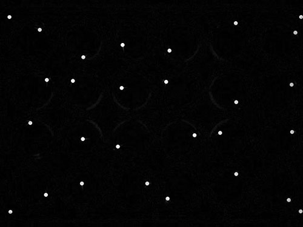

# drtracker 1.0.2  

`drtracker` is an R package to track movement of Zebrafish larvae in 24 or 48 well assay plates from xy data and then compute track properties such as distance and speed.  

## 1. Installation  
```r
#load devtools package
library(devtools)
install_github('royfrancis/drtracker')

#load library for use
library(drtracker)
```
## 2. Considerations  

+ Code is designed for 24 or 48 well plates only.  
+ Lighting must induce minimal reflection on plates.  
+ Single larvae per well.  
+ Videos with 100 frames or more work better.  
+ Note the framerate of the video in fps (frames per second).  
+ Calibrate the size in the video to determine 1 pixel = ? mm.  
+ Uncompressed .avi video files are best.  

## 3. Workflow  
The workfow can be divided into *Detection*, *Linking* and *Track Statistics*. Detection involves identifying the spots on each frame. Detection can be done using any means and using any software. For this demonstration, I will use ImageJ for *Detection* and generating xy coordinate data. *Linking* is the process of connecting the xy coordinates frame to frame to create tracks. And the final step is generating track statistics from tracks. *Linking* and *Track Statistics* will be done in R. I am running Windows 8.1 64 bit, R 3.2.0 64 bit and Fiji ImageJ 1.50b. I am using 24 well plates.  

### 3.1 Detection

Detection id carried out in ImageJ.  
1. The video must be imported into Fiji ImageJ. If the video is not in .avi format, convert to uncompressed .avi using a tool such as VirtualDub.   
2. Save the video as a .tif sequence and/or continue to next step.  

  
__Fig 1.__ *View of a typical 24 well plate with few day old single zebrafish larvae in each well.*  

3. Mark the edges of plate (4 spots) and larvae positions on frame 1. Set the brush size to something like size 8-10 black colour. If the well/wells are empty, do not mark anything. When marking the 4 edge spots, imagine connecting the 4 spots to create a rectangle. No larval position must touch that rectangle. If they do, then mark the edges further out.     

  
__Fig 2.__ *View of a plate with marking in the first frame. The edges of the wells and the positions of larvae are marked in frame 1.*  

4. Remove background. Go to `Image` > `Stacks` > `Z Project`. Set `Projection type` to `Average Intensity`. Click `OK`. Go to `Process` > `Image Calculator`. Choose the tif stack/sequence as `Image1`, the averaged single image as `Image2` and set `Operation` to `Difference`. Check `Create new window` and `32-bit (float) result`. Click `OK`. In the `Process Stack?` window, click `Yes`.  

  
__Fig 3.__ *Blank plate after Average Z stack. Works best when larvae moves around a lot and number of frames are at least few hundred.*  

  
__Fig 4.__ *Larval positions without the plate after Image Difference.*  

5. Convert to binary. Go to `Image` > `Adjust` > `Threshold`. Change `Default` to `Max Entropy`. Check `Dark background` and uncheck `Stack histogram`. Click `Apply`. When `NaN Background` windows opens, uncheck `Set background pixels to NaN`. Click `OK`. In the `Convert Stack to binary` window, check `Calculate threshold for each image`, uncheck `Only convert current image`, leave rest as default, then, click `OK`.  

  
__Fig 5.__ *Image after thresholding.* 

6. Remove stray spots. Go to `Process` > `Binary` > `Options`. Set `Iterations` to `2`, `Count` to `5`, check `Black background`, uncheck `Pad edges..`, set `EDM output` to `Overwrite` and `Do` to `Erode`. Click `OK`. In the `Process Stack?` window, click `Yes`. This will remove small stray spots.  

Then go to same `Options` and set `Iterations` to `10`, `Count` to `3` and `Do` to `Dilate`. Click `OK`. In the `Process Stack?` window, click `Yes`. This will remove more small stray spots and enlarge the spots.  

The first frame must have exactly 24 larvae spots and the four edge spots. Any extra spots must be removed with the brush tool by painting black.  

  
__Fig 6.__ *Image after Erosion/Dilation.* 

7. Analyse spots. Go to `Analyze` > `Set measurements`. Check `Area`, `Centroid` and `Stack position`. Click `OK`.

Go to `Analyze` > `Analyze particles`. `Size` should be `0-Infinity`, `Circularity` as `0.00-1.00` and `Show` `Nothing`. Check `Display results` and uncheck `Exclude on edges`. Click `OK`. In the `Process Stack?` window, click `Yes`.  

8. Save the binary video file if required. Save the `Results` table with suitable filename as .txt. The filename will be used to refer to this file in further analyses.  

### 3.2 Linking and Track Statistics using `drtracker`  

The input file can be prepared in any way or generated from any application. The input file must be a tab-delimited dot (.) as decimal text file. The file must have a minimum of three columns named `x`, `y` and `slice`. We use the text file exported from ImageJ. Start R and load `drtracker` library. Use function `ltrack()`.  

```r
library(drtracker)

#Help and all arguments
?ltrack

#Usage
#Use mm and fps values for your video. Text data and plots are exported by default.
ltrack(choose.files(), wells=24, mm=5.4, fps=25)

#To not export text and plots, use
ltrack(choose.files(), wells=24, mm=5.4, fps=25, exportplot=FALSE, exportdata=FALSE)
```

#### Spot results  

The spots are assigned to wells and the plate layout with well numbers and spots are exported as an image if `exportplot=T`.

  
__Fig 7.__ *Layout of the plate with well numbers showing spots in each well.*  

  
__Fig 8.__ *Spot plot for a 48-well plate.* 

#### Track results  

The tracks as lines are plotted if `exportplot=T`. If `exportdata=T`, then the spots, tracks and all raw data is exported as a tab-delimited text file.  

  
__Fig 9.__ *Layout of the plate with well numbers showing tracks in each well. The track length in pixels is shown below each track. The tracks are also coloured by track length.*  

  
__Fig 10.__ *Track results for a 48-well plate*  

  
__Fig 11.__ *Plate layout showing area covered by larval activity. Number show area in pixels square.*  

#### Track statistics  

The track distance, speed etc and other track details are exported as a text file when `exportdata=T`. The total distance for each track is plotted and exported when `exportplot=T`.

  
__Fig 12.__ *Barplot showing total distance covered by each larvae in pixels.*  

The results produced can be saved to a variable and used for further analyses.  

```r
dframe <- ltrack(choose.files(), wells=24, mm=5.4, fps=25)
```

### 4. Algorithm  
The function `ltrack()` accepts xy coordinates for each spot along with the slice/frame number. The number of wells are defined. Every spot is allocated to one of the wells using nearest neighbour search (function `nn2()` from package `RANN`). Each spot on frame 1 is assigned an id. Then, each spot is connected from one frame to the next frame. A spot is selected and the algorithm searches for a spot in the next frame in the same well using one of three approaches: *single*, *nearest* or *duplicated*. If a single spot was identified in the next frame (in same well), then *single* is assigned to the point. If more than one point was found in the next frame (same well), then the nearest point is selected and assigned *nearest*. If no point was found in the next frame (same well), then the previous point is duplicated. Once a spot is defined in the next frame, the same id is assigned to that spot. This is iterated to the end of all frames.  

For the area covered by larval activity (coverage), the convex hull (`chull()`) is computed from spot data per well and the area of the polygon is calculated.  

The total distance covered by each id is the sum of distance covered per frame. The speed is calculated as the distance moved per second. A second is defined by framerate. For example, in a 25 fps video, the distance covered every 25 frames is computed and stored. The mean value of all such stored values is the mean speed. The max value of all such stored values is the max speed.  

2015 Roy M Francis | roy.m.francis@outlook.com
